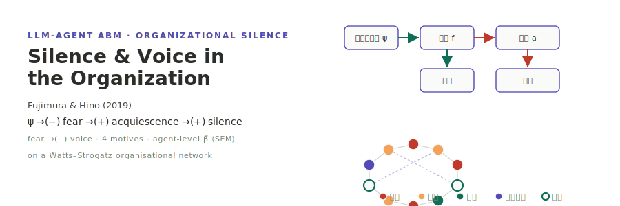

<p align="center"></p>

[English](README.md) | **日本語**

# 藤村・日野 (2019) — 組織における沈黙と発言の規定要因

**藤村まこと・日野健太 (2019)「組織における沈黙と発言の規定要因 ―心理的安全と沈黙動機の影響過程―」**（*組織学会大会論文集* 8(1), 183–188）の **LLM 駆動エージェント ABM** による再現実装である．

原著は日本サンプル（N=204）で構造方程式モデル（SEM）を構築した：**心理的安全 → 怖れ（Quiescent）動機 → 黙従（Acquiescent）動機 → 沈黙**，および **怖れ → （抑制される）発言**．沈黙と発言は独立した行動次元であり（r=.02），無相関であることが示された．本実装はこの SEM を socsim の `WorldState` + 8 つの `Mechanism`（Watts–Strogatz 組織ネットワーク上）へ翻訳し，発言決定を日本職場文脈にローカライズした LLM プロンプトで駆動する．ABM 由来の標準化パス係数 β̃ を [semopy](https://semopy.com/) で推定し，原著の 4 主要パスと照合する．

> **用語**：原著本文・図 1（一次情報）に従い，**Quiescent = 怖れ**（怖れによる），**Acquiescent = 黙従**（諦めによる）と対応させる．

## 二層決定論

LLM 出力は socsim の bit 再現性の**外側**にあるため，設計は二層に分かれる：

- **決定論的 socsim コア** — 従業員初期化（原著の M/SD から潜在状態をサンプル），Watts–Strogatz ネットワーク生成，スケジューリング，7 つの決定論的メカニズム + ルールモードの `voice_decision_rule`．シード固定で bit 完全再現．`--decision-mode rule` は完全にここで完結し，LLM 呼び出しは**ゼロ**．
- **非決定論的 LLM 層** — `voice_decision` のみ．`socsim-llm` の `CachingClient`（`hash(prompt+model)` → 応答キャッシュ），`temperature = 0`，`(agent_id, t)` 由来の固定シードで擬似決定論化．プロバイダ順序は **Ollama 第一 → OpenAI フォールバック**．

キャッシュ（モデルではない）が再現性の機構である．温暖キャッシュは同一応答を再生する．各実行は `llm_meta.json` に決定モード / モデル / エンドポイント / 温度 / シード / cache-hit 率 / パース失敗率を記録する．

## インストールとクイックスタート

```bash
# Rust シミュレーションのビルド（socsim・socsim-llm を取得）．
cargo build --release

# === ルールモード（LLM 不要）— bit 決定論ベースライン，日本ロケール ===
cargo run --release -- run --decision-mode rule --locale ja-JP \
    --n-teams 5 --team-size 80 --eta 0.7 --network-beta 0.05 \
    --t-max 12 --runs 30 --seed 2019

# === LLM モード（Ollama 第一） ===
#   ollama pull llama3.1
export OLLAMA_HOST=http://localhost:11434
export OLLAMA_MODEL=llama3.1
cargo run --release -- run --decision-mode llm --locale ja-JP \
    --cache-path .llm_cache/cache.json --t-max 12 --runs 30 --seed 2019

# === 感度スイープ（階層 L × 上司均質性 η × ネットワーク β × seeds） ===
cargo run --release -- sweep --decision-mode rule --locale ja-JP \
    --n-levels-values 2,3,4,5 --eta-min 0.3 --eta-max 0.9 --eta-step 0.1 \
    --network-beta-values 0.05,0.10,0.20 --runs 20 --seed 2019

# === 文化比較（JP vs EN ロケールを並走） ===
cargo run --release -- cultural-compare --decision-mode rule --runs 30 --seed 2019

# Python 可視化・SEM フィッティング・再現ツール（ワークスペース直下）
uv sync
uv run fujimura-tools fit-sem                  # semopy：4 パス β̃ + CFI/GFI/RMSEA・アンカー照合
uv run fujimura-tools visualize                # 時系列 + motive_mix + SEM パス図
uv run fujimura-tools visualize-sweep          # パス係数 forest + 風土ヒートマップ
uv run fujimura-tools show-experiment-settings # config / sweep_config / llm_meta
uv run fujimura-tools reproduce                # 図 1 相当パス図 + B1--B5 照合
```

## 出力

各 `run` は `results/` 配下にタイムスタンプ付きディレクトリを書く（`results/latest` で参照）：

| ファイル | 内容 |
|---------|------|
| `agent_panel.csv` | long 形式：`seed, t, agent_id, psafety, fear, acquiescent, voice, silence, motive` — `fit-sem` の入力 |
| `metrics.csv` | tick 単位 `silence_rate, voice_volume, climate_of_silence, motive_mix_*` |
| `sem_fit.json` | ABM 由来 SEM の β̃・95%CI・適合度・`corr_silence_voice`（`fit-sem` が書く） |
| `sweep_summary.csv` | スイープ各セル 1 行（`sweep` コマンド） |
| `llm_meta.json` | モデル / エンドポイント / 温度 / シード / cache-hit 率 / パース失敗率 |

## ドキュメント

- [アーキテクチャ](docs/architecture.ja.md) — `SilenceWorld`，8 メカニズム × 6 フェーズ，RNG ストリーム，SEM 対応．
- [CLI リファレンス](docs/cli.ja.md) — `run` / `sweep` / `cultural-compare` / `reproduce` フラグ．
- [ユースケース](docs/usecases.ja.md) — JP ベースライン，感度分析，文化 ablation．
- [可視化](docs/visualization.ja.md) — Python ツールと図．
- [再現](docs/reproduction.ja.md) — §5 アンカー（B1–B14）と β̃ 推定法．

## 参考文献

藤村まこと・日野健太 (2019). 組織における沈黙と発言の規定要因 ―心理的安全と沈黙動機の影響過程―. *組織学会大会論文集*, 8(1), 183–188.

[socsim](https://github.com/akitenkrad/rs-social-simulation-tools)（`socsim-core` / `socsim-engine` / `socsim-net` / `socsim-llm` / `socsim-metrics` / `socsim-results`）上に構築．

## ライセンス

MIT（[LICENSE](LICENSE) 参照）．

---
*This file was generated by Claude Code.*
