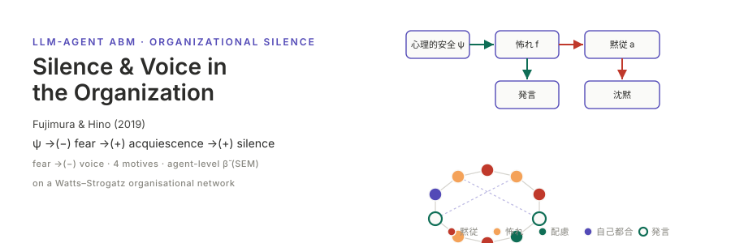

<p align="center"></p>

**English** | [日本語](README.ja.md)

# Fujimura & Hino (2019) — Silence & Voice in the Organization

An LLM-agent agent-based-model (ABM) replication of **Fujimura & Hino (2019), "Silence and voice in the organization: The influences of silence motives and psychological safety" (組織における沈黙と発言の規定要因 ―心理的安全と沈黙動機の影響過程―)** (*Transactions of the Academic Association for Organizational Science*, 8(1), 183–188).

The paper builds a structural-equation model (SEM) on a Japanese sample (N = 204): **psychological safety → fear (Quiescent) motive → acquiescent (黙従) motive → silence**, plus **fear → (suppressed) voice**, with silence and voice found to be *independent* behavioural dimensions (r = .02). This replication translates that SEM into a socsim `WorldState` + 8 `Mechanism`s on a Watts–Strogatz organisational network, drives the voice decision with a Japanese-localised LLM prompt, and estimates the ABM-induced standardized path coefficients β̃ with [semopy](https://semopy.com/) for side-by-side comparison against the paper's four anchor paths.

> **Terminology.** Following the paper body and Fig. 1 (the primary source): **Quiescent = 怖れ** (fear-based) and **Acquiescent = 黙従** (resignation).

## Two-layer determinism

LLM output is **outside** socsim's bit-reproducibility, so the design splits into two layers:

- **Deterministic socsim core** — employee initialisation (latent states sampled from the paper's M/SD), Watts–Strogatz network generation, scheduling, and the 7 deterministic mechanisms plus the rule-mode `voice_decision_rule`. Given a seed this reproduces bit-for-bit. The `--decision-mode rule` path lives entirely here and makes **zero LLM calls**.
- **Non-deterministic LLM layer** — `voice_decision` only. Pseudo-determinised by `socsim-llm`'s `CachingClient` (a `hash(prompt+model)` → response cache), `temperature = 0` and a fixed `(agent_id, t)`-derived seed. Provider order is **Ollama first → OpenAI fallback**.

The cache — not the model — is the reproducibility mechanism: a warm cache replays identical responses. Each run records the backend it actually spoke to in `run.json`'s `llm` block (provider / model / temperature) and the call breakdown as run-scope metrics (`llm_calls` / `llm_cache_hits` / `llm_cache_hit_rate` / `llm_parse_failures` / `llm_parse_fail_rate`). A `rule`-mode run has neither, because it makes no calls.

## Install & Quick start

```bash
# Build the Rust simulation (fetches socsim incl. socsim-llm with Ollama+OpenAI backends).
cargo build --release

# === Rule mode (no LLM) — bit-deterministic baseline, Japanese locale ===
cargo run --release -- run --decision-mode rule --locale ja-JP \
    --n-teams 5 --team-size 80 --eta 0.7 --network-beta 0.05 \
    --t-max 12 --runs 30 --seed 2019

# === LLM mode (Ollama first) ===
#   ollama pull llama3.1
export OLLAMA_HOST=http://localhost:11434
export OLLAMA_MODEL=llama3.1
cargo run --release -- run --decision-mode llm --locale ja-JP \
    --cache-path .llm_cache/cache.json --t-max 12 --runs 30 --seed 2019

# === Sensitivity sweep (hierarchy L × supervisor homogeneity η × network β × seeds) ===
cargo run --release -- sweep --decision-mode rule --locale ja-JP \
    --n-levels-values 2,3,4,5 --eta-min 0.3 --eta-max 0.9 --eta-step 0.1 \
    --network-beta-values 0.05,0.10,0.20 --runs 20 --seed 2019

# === Cultural comparison (JP vs EN locales side by side) ===
cargo run --release -- cultural-compare --decision-mode rule --runs 30 --seed 2019

# Python visualization, SEM fitting & reproduction tools (workspace root)
uv sync
uv run fujimura-tools fit-sem                  # semopy: 4 path β̃ + CFI/GFI/RMSEA, anchor reconciliation
uv run fujimura-tools visualize                # time-series + motive_mix + SEM path diagram
uv run fujimura-tools visualize-sweep          # path-coefficient forest + climate heatmap
uv run fujimura-tools show-experiment-settings # conditions + the LLM block and call breakdown
uv run fujimura-tools reproduce                # Fig.1-style path diagram + B1--B5 reconciliation
```

## Outputs

Runs are recorded with [runvault](https://github.com/akitenkrad/rs-runvault): one run is one directory under `results/fujimura-silence/`, named and hashed by runvault. There is no timestamped directory and no `results/latest` symlink.

`--runs N` is **N replicates of one condition**, and a replicate is a run: `run` and `cultural-compare` write a parent run declaring the condition and the replicate list, plus one child run per replicate. `sweep` writes a parent declaring the grid, plus one child per cell, whose trials are `terminal` rows in `events.jsonl`.

| File | Contents |
|------|----------|
| `config.json` | the envelope; the conditions live under `parameters` |
| `run.json` | identity: the three hashes, `master_seed`, `replicate_index`, `lineage`, the `llm` block |
| `metrics.csv` | long format `run_uid, step, step_unit, scope, name, value`. Per-step `silence_rate` / `voice_volume` / `climate_of_silence` / `motive_mix_*` at `scope=run`; `corr_silence_voice` / `final_round` / `llm_*` with no step |
| `events.jsonl` | `sweep-point` children only: one `terminal` row per trial (the old `sweep_summary.csv` row) plus its `observation` |
| `reference.csv` | the paper's reported `corr_silence_voice` (r = .02) with its source |
| `artifacts/agent_panel.csv` | long format: `seed, t, agent_id, psafety, fear, acquiescent, voice, silence, motive` — the input to `fit-sem` |

`sem_fit.json` and the PNGs are written **beside** the run, in `results/fujimura-silence/figures/<run_slug>/`: `manifest.csv` is settled when the run finishes, so anything made afterwards is not part of the record.

Point the tools at a run with `--results-dir`, or let them ask runvault:

```bash
runvault path --experiment fujimura-silence --latest --subcommand run
```

## Documentation

- [Architecture](docs/architecture.md) — `SilenceWorld`, the 8 mechanisms × 6 phases, RNG streams, the SEM mapping.
- [CLI reference](docs/cli.md) — `run` / `sweep` / `cultural-compare` / `reproduce` flags.
- [Use cases](docs/usecases.md) — JP baseline, sensitivity analysis, cultural ablation.
- [Visualization](docs/visualization.md) — the Python tools and their figures.
- [Reproduction](docs/reproduction.md) — the §5 anchors (B1–B14) and how β̃ is estimated.

## Reference

藤村まこと・日野健太 (2019). 組織における沈黙と発言の規定要因 ―心理的安全と沈黙動機の影響過程―. *組織学会大会論文集*, 8(1), 183–188.

Built on [socsim](https://github.com/akitenkrad/rs-social-simulation-tools) (`socsim-core` / `socsim-engine` / `socsim-net` / `socsim-llm` / `socsim-metrics` / `socsim-results`).

## License

MIT (see [LICENSE](LICENSE)).
